# Pertemuan 4
Nama : Kintan Kinasih Mahaputri

NIM : H1D022019

Shift : A

# ScreenShoot
1. Login
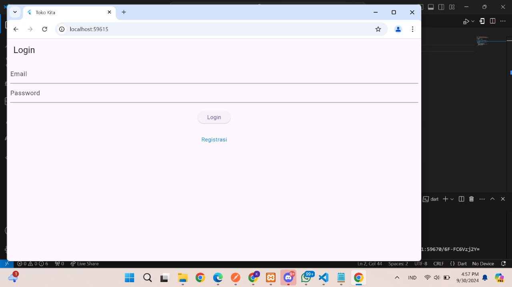
2. Ubah Produk
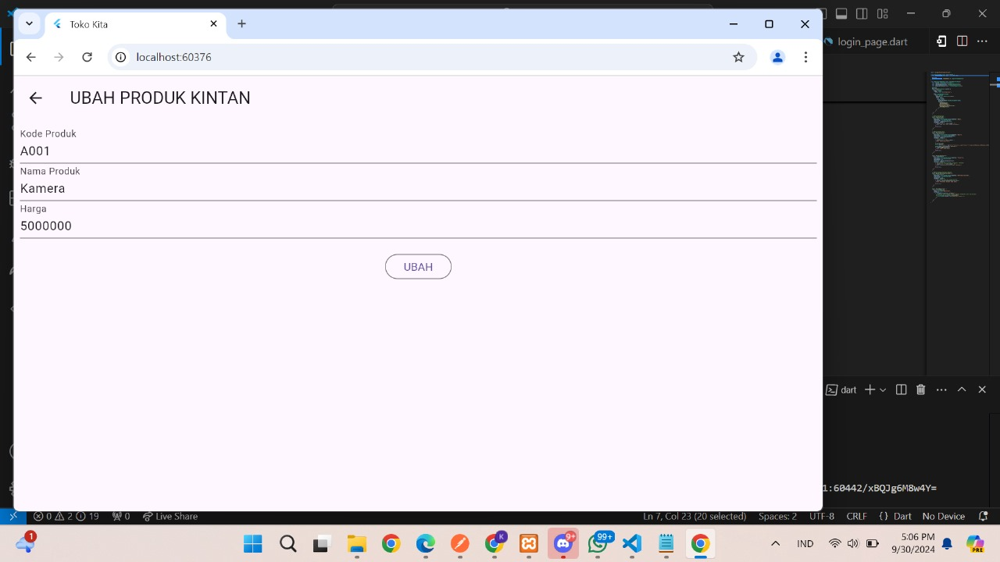
3. Detail Produk
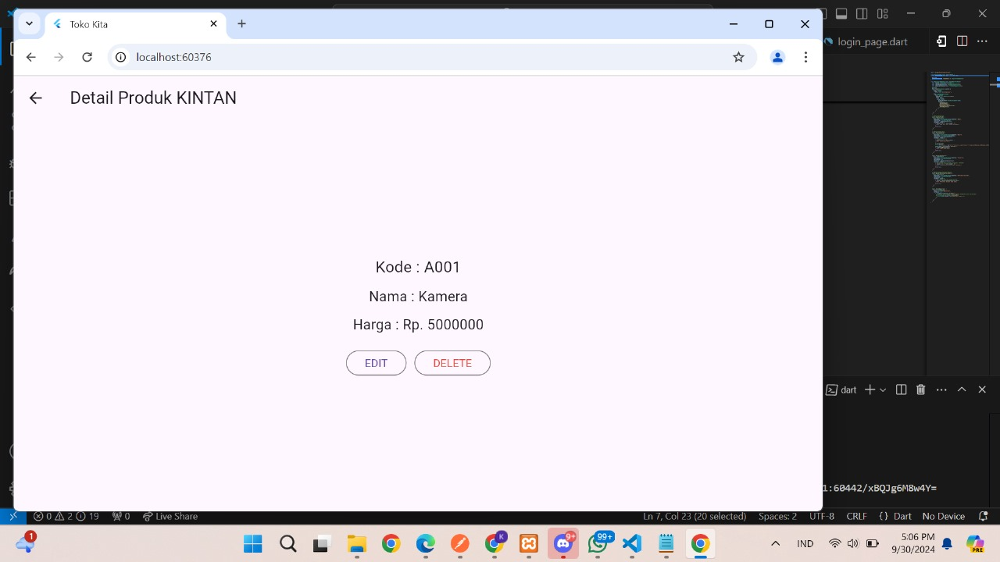
4. Registrasi
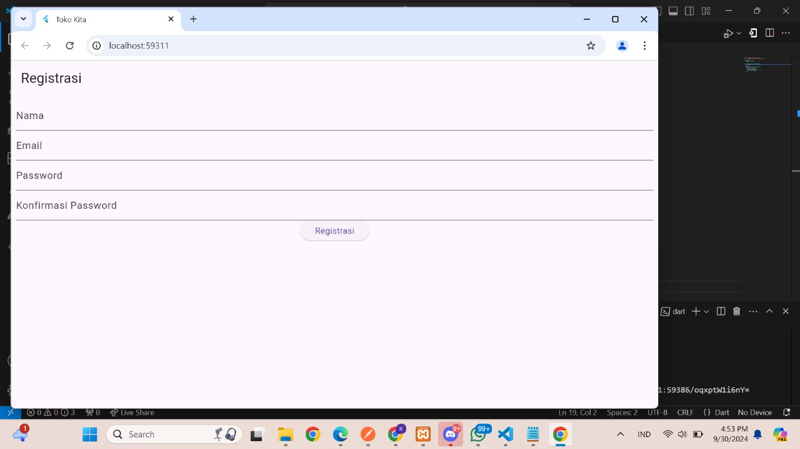
5. Tambah Produk
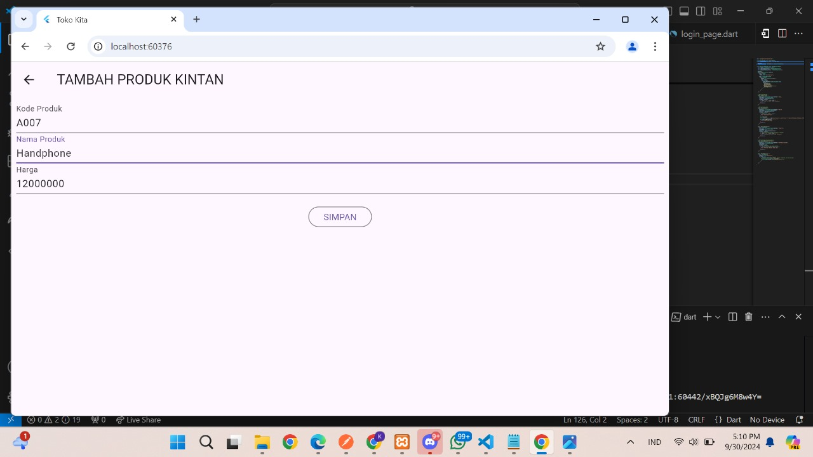
6. List Produk
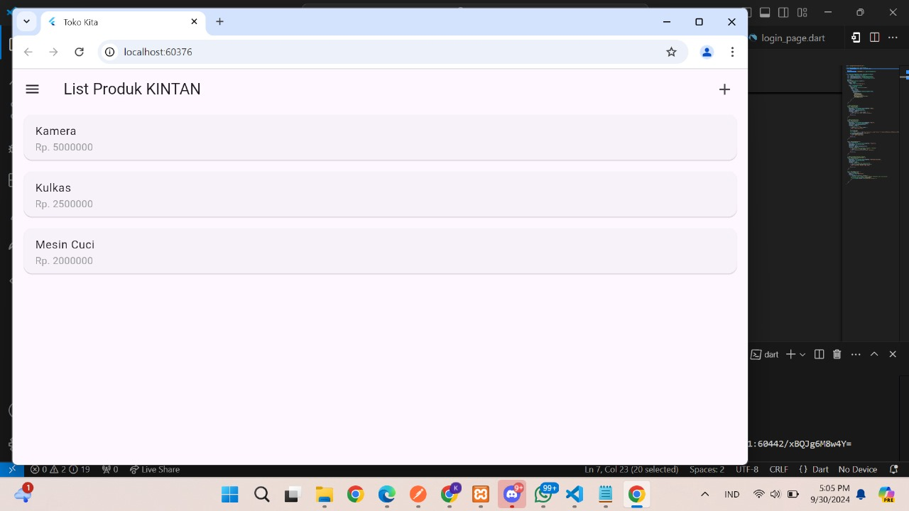


### Pertemuan 5

### Alur Penggunaan Website

1. **Proses Registrasi**  
     Pada tahap ini, pengguna mengisi informasi registrasi, seperti nama, email, kata sandi, dan konfirmasi kata sandi. Data yang telah diisi akan dikirim ke server untuk disimpan dalam database. Berikut kode untuk mengirimkan data:

     ```dart
     RegistrasiBloc.registrasi(
       nama: _namaTextboxController.text,
       email: _emailTextboxController.text,
       password: _passwordTextboxController.text
     );
     ```
     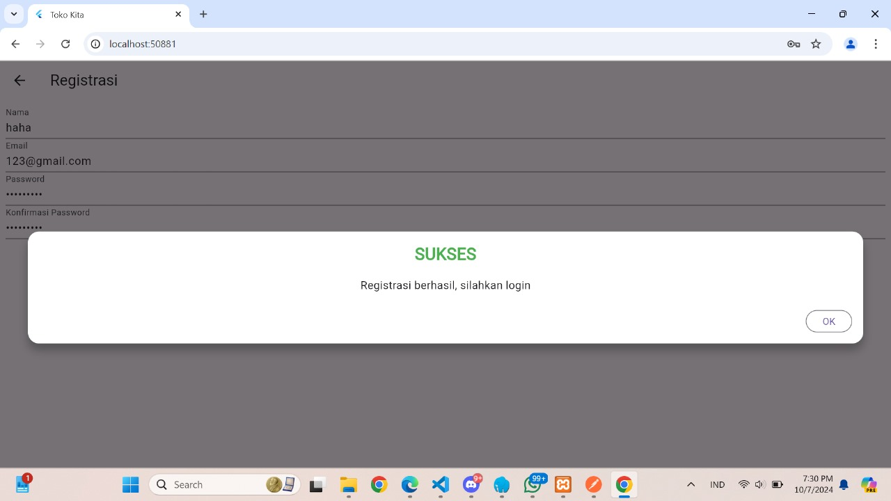  
     Setelah proses registrasi selesai, pengguna akan melihat pop-up notifikasi yang menandakan bahwa pendaftaran berhasil. Berikut contoh kode untuk menampilkan pop-up:

     ```dart
     showDialog(
       context: context,
       barrierDismissible: false,
       builder: (BuildContext context) => SuccessDialog(
         description: "Registrasi berhasil, silahkan login",
         okClick: () { Navigator.pop(context); }
       )
     );
     ```

2. **Proses Login**  
   - a. **Input Data untuk Login**  
     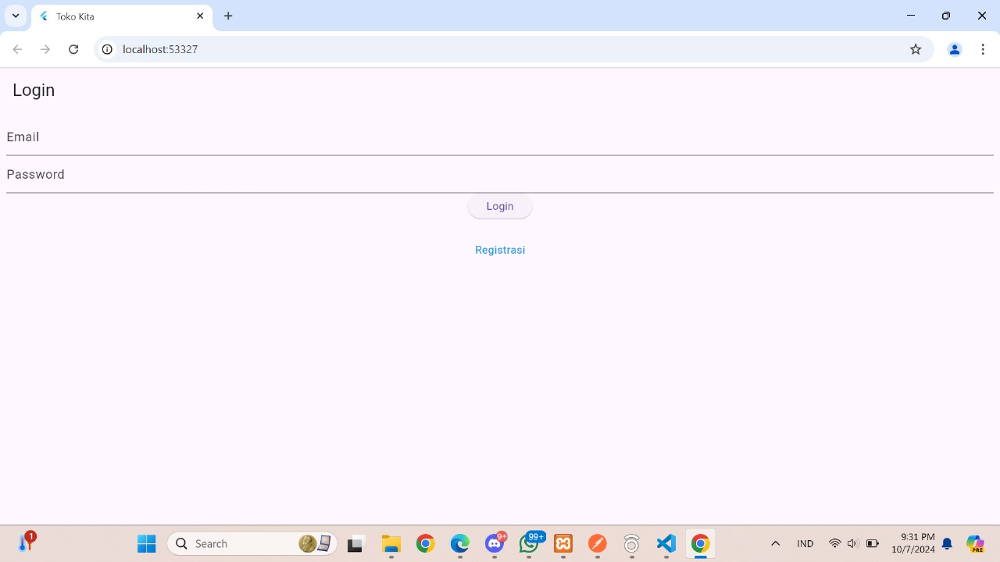  
     Pengguna memasukkan email dan kata sandi pada form login. Data tersebut dikirim ke API untuk proses autentikasi. Contoh kodenya:

     ```dart
     LoginBloc.login(
       email: _emailTextboxController.text,
       password: _passwordTextboxController.text
     );
     ```

   - b. **Pop-up Login Gagal**  
     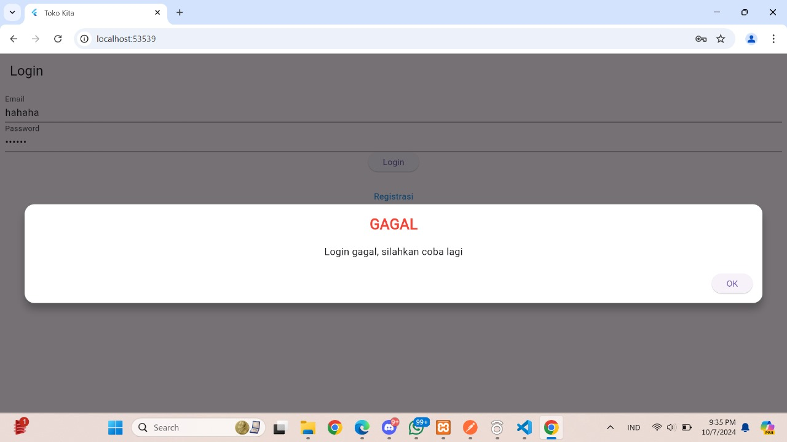  
     Jika login gagal (misalnya, jika email atau kata sandi salah), pop-up notifikasi akan muncul untuk memberi tahu pengguna bahwa login gagal. Berikut kodenya:

     ```dart
     showDialog(
       context: context,
       barrierDismissible: false,
       builder: (BuildContext context) => WarningDialog(
         description: "Login gagal, silahkan coba lagi",
       )
     );
     ```

3. **Proses Menambah Produk Baru**  
   - a. **Input Data Produk**  
     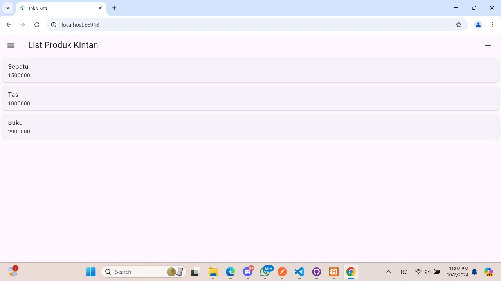  
     Pengguna dapat menambahkan produk baru dengan mengisi informasi seperti kode produk, nama, dan harga. Data ini akan dikirim ke server dan disimpan di database. Contoh kodenya:

     ```dart
     ProdukBloc.addProduk(
       produk: Produk(
         kodeProduk: _kodeProdukController.text,
         namaProduk: _namaProdukController.text,
         hargaProduk: int.parse(_hargaProdukController.text)
       )
     );
     ```

   - b. **Produk Berhasil Ditambahkan**  
     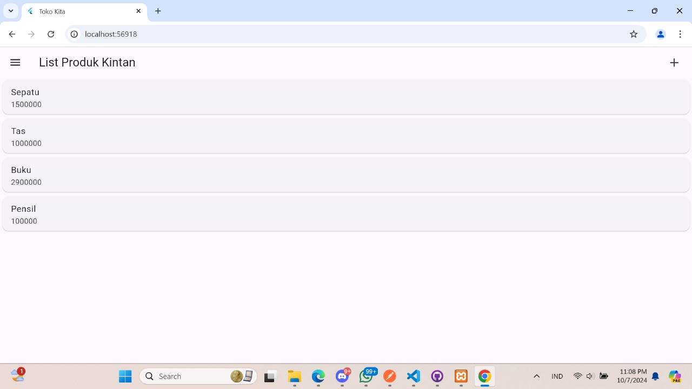  
     Notifikasi akan muncul setelah produk berhasil ditambahkan ke dalam database.

4. **Proses Melihat Detail Produk**  
   - a. **Melihat Detail Produk**  
     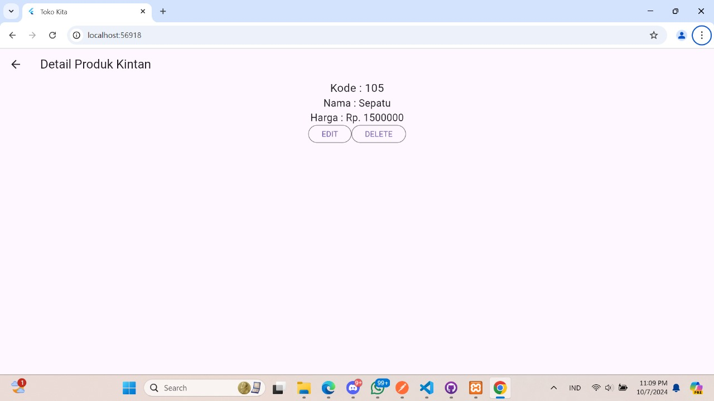  
     Pengguna dapat melihat detail dari suatu produk dengan mengklik produk tersebut di daftar produk. Berikut adalah cara navigasi ke halaman detail produk:

     ```dart
     Navigator.push(
       context,
       MaterialPageRoute(
         builder: (context) => ProdukDetail(produk: produk)
       )
     );
     ```

5. **Proses Mengubah Produk**  
   - a. **Input Data Ubah Produk**  
     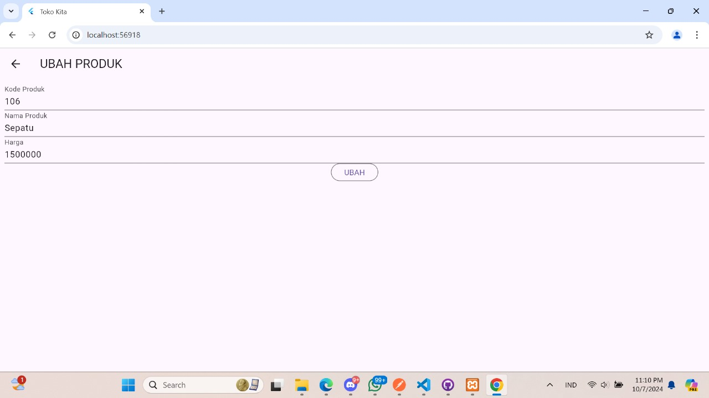  
     Pengguna dapat mengedit informasi produk, seperti nama, kode, atau harga produk, kemudian menyimpan perubahan tersebut ke database. Berikut kodenya:

     ```dart
     ProdukBloc.updateProduk(
       produk: Produk(
         id: produk.id,
         kodeProduk: _kodeProdukController.text,
         namaProduk: _namaProdukController.text,
         hargaProduk: int.parse(_hargaProdukController.text)
       )
     );
     ```

   - b. **Produk Berhasil Diubah**  
     Menampilkan notifikasi bahwa produk berhasil diubah.

6. **Proses Menghapus Produk**  
   - a. **Konfirmasi Hapus Produk**  
     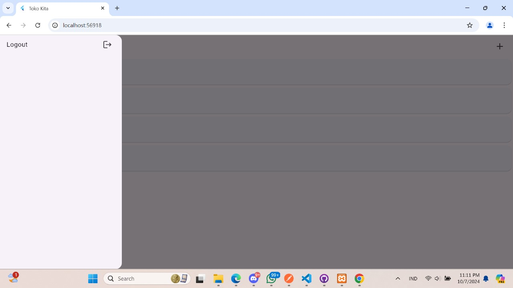  
     Saat pengguna menekan tombol hapus, sistem akan menampilkan dialog konfirmasi untuk memastikan apakah pengguna ingin menghapus produk tersebut. Contoh kodenya:

     ```dart
     showDialog(
       context: context,
       builder: (BuildContext context) => AlertDialog(
         content: const Text("Yakin ingin menghapus produk ini?"),
         actions: [
           OutlinedButton(
             child: const Text("Ya"),
             onPressed: () {
               ProdukBloc.deleteProduk(id: produk.id);
               Navigator.pop(context);
             }
           ),
           OutlinedButton(
             child: const Text("Batal"),
             onPressed: () => Navigator.pop(context),
           )
         ]
       )
     );
     ```

   - b. **Produk Berhasil Dihapus**    
     Menampilkan notifikasi bahwa produk telah berhasil dihapus dari database.

7. **Proses Logout**  
   - a. **Tombol Logout**  
       
     Pengguna dapat keluar dari aplikasi dengan menekan tombol logout. Ini akan menghapus sesi pengguna dan mengarahkan kembali ke halaman login. Berikut adalah kodenya:

     ```dart
     ListTile(
       title: const Text('Logout'),
       onTap: () async {
         await LogoutBloc.logout();
         Navigator.pushAndRemoveUntil(
           context,
           MaterialPageRoute(builder: (context) => LoginPage()),
           (route) => false
         );
       }
     );
     ```
